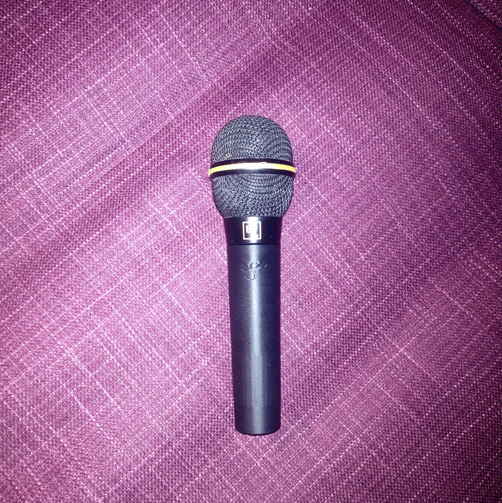

# Handle for EV N/D767a

The original handle to this mic is a rubbery material and disintergrated on my ~20 year old example. I designed this version to be a very secure push fit. You might need to scale slightly (100.5% or 101%) or run a round file through it to get a good fit.

I printed mine in ABS as it's used as a stand mic, but this should work in stiffer TPU. Beware PLA, on a hot stage an expensive mic can slide out of what was a good friction fit and it can shatter.

Both the STL and STEP are supplied as multipart models so you can split into objects to try fuzzy skin or multi-material.

[Creative Commons Attribution-ShareAlike 4.0 International](LICENSE_CC-BY-SA.md)

The STL and STEP contain the Straylight logo. These parts are CC-BY Rowland Straylight. This logo has been removed from the .f3d By all means modify this, the f3d is available **additionally** under the [GPL](LICENSE.txt) and no attribution is required, but it would be nice. I try to keep my work as free and open as possible.

!
[Assembled mic](images/assembled-render.jpg)