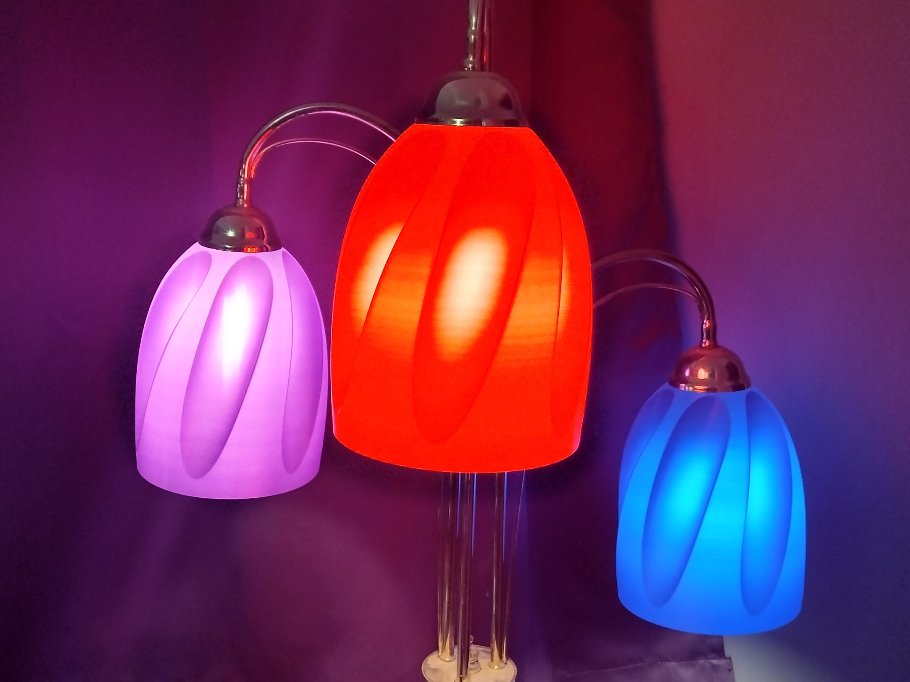

# Spiral Cutout Lampshade

I was experimenting with geometric ideas for vase mode prints. These have been in use in my home for over a year and work incredibly well. 

Fits E14 bulb holders, use with LED bulbs only. 

I printed these in PrusaSlicer with a 0.4mm nozzle using 0.9mm line width. Yes you can do that with a 0.4m nozzle and it makes really nice looking prints. Use translucent PET-G for more illumination or PLA that is normally opaque for a soft atmospheric glow. I use this light in the evening for a soft glow. This was printed in 3DTomorrow's Ultramarine Blue, an experimental red that's lighter than their production Ruby red, and some AMAZD purple that's showing some banding from inconsistent filament diamater. These will really highlight variations in extrusion so using filamant with really consisten diameter is reccommended.

