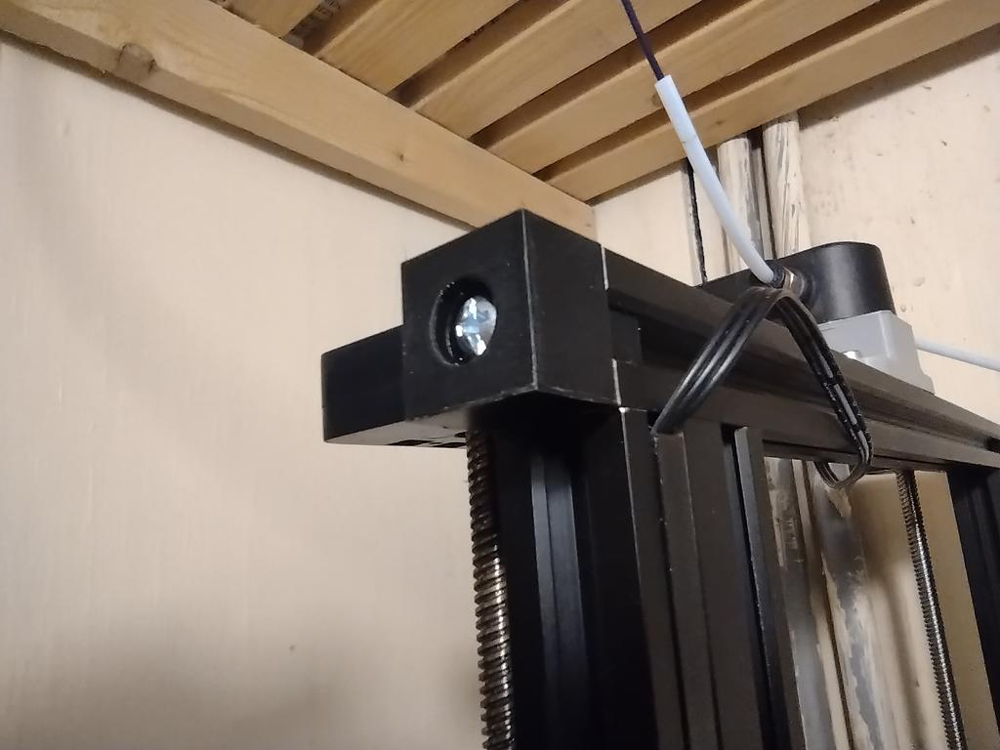

# Z Endstop for Dual Z alignment G34

These are the printable parts for [G34 MECHANICAL_GANTRY_ALIGN](https://github.com/strayr/strayr-k-macros/blob/main/mechanical_level_tmc2209.cfg), part of [strayr-k-macros](ttps://github.com/strayr/strayr-k-macros). There is [an article about G34](https://strayr.github.io/marlin/klipper/2022/08/27/g34.html) on my website that explains more about this.

